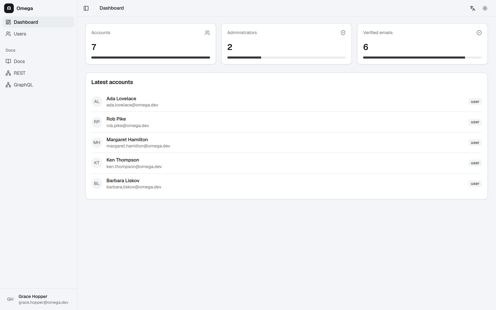
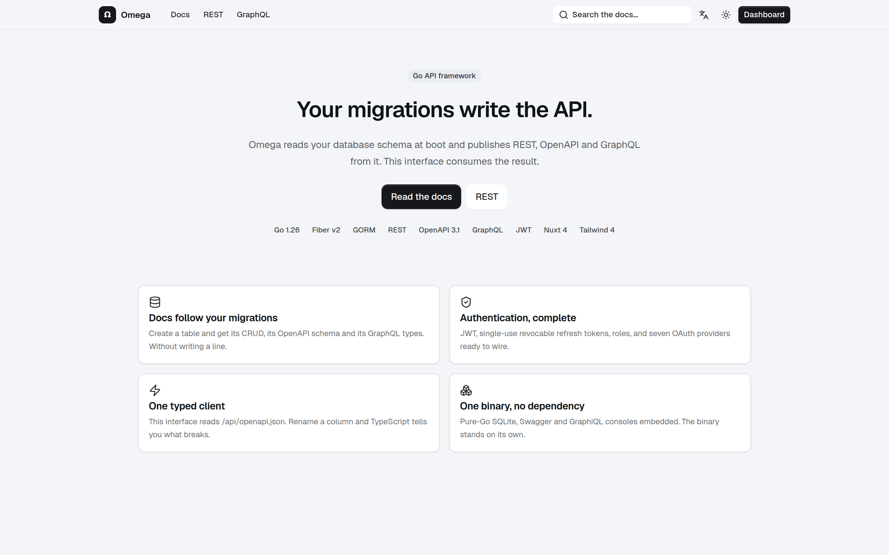
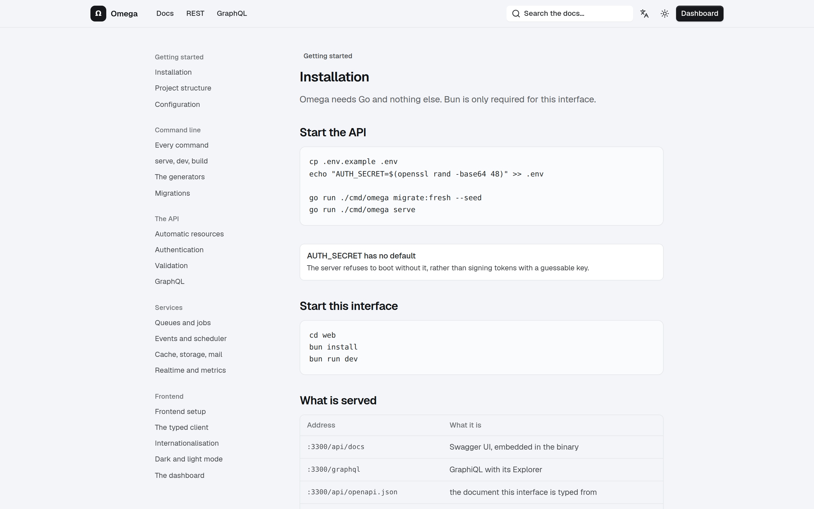
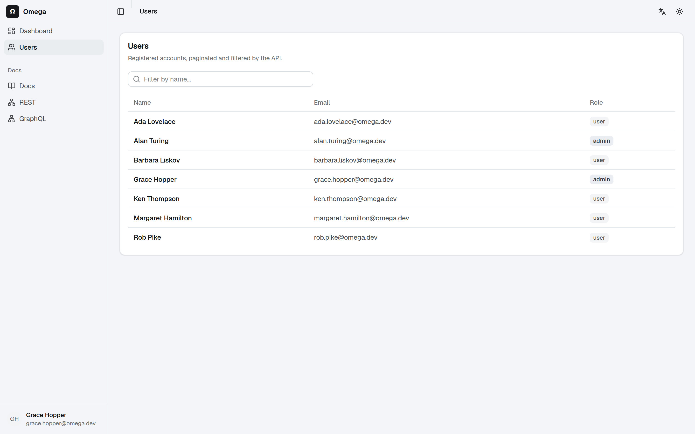
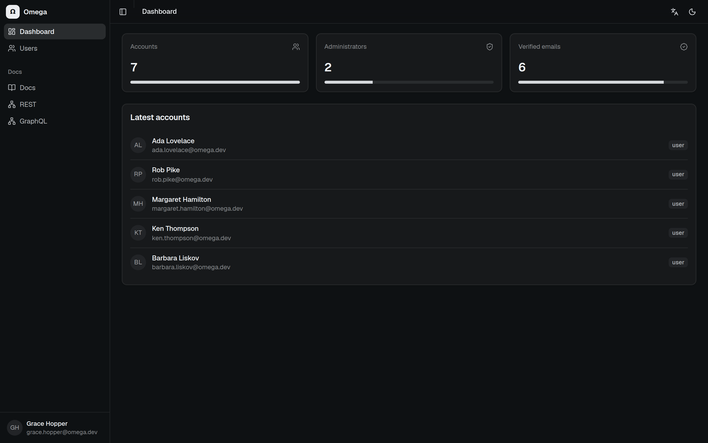
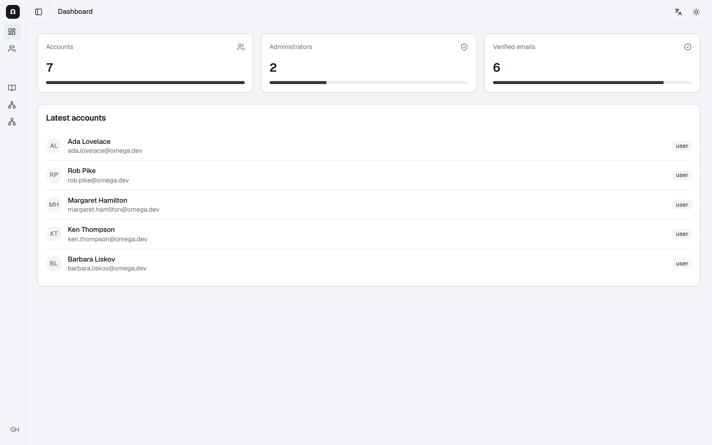

<h1 align="center">Ω Omega</h1>

<p align="center">
  A Go framework for JSON APIs.<br>
  Fiber · GORM · REST + OpenAPI + GraphQL · JWT
</p>

<p align="center">
  
  
  
  
</p>

<p align="center">
  
</p>

One command seals it: `omega web:nuxt`, `omega web:react` or `omega web:next`
generates a complete frontend — dashboard, documentation, authentication —
already wired to your API.

<p align="center">
  
</p>

<table>
  <tr>
    <td width="50%"></td>
    <td width="50%"></td>
  </tr>
  <tr>
    <td align="center"><sub>Documentation served by the application</sub></td>
    <td align="center"><sub>Resources generated from the schema</sub></td>
  </tr>
  <tr>
    <td width="50%"></td>
    <td width="50%"></td>
  </tr>
  <tr>
    <td align="center"><sub>Light and dark themes</sub></td>
    <td align="center"><sub>Collapsible sidebar</sub></td>
  </tr>
</table>

> **Status: milestone 3.** The whole initial roadmap is implemented: kernel,
> schema-generated API, authentication, validation, queues, events, scheduler,
> cache, storage, mail, rate limiting, SSE, WebSocket, metrics, policies,
> `omega new`, Docker and CI.
> See [Roadmap](#roadmap) for what is left.

## Getting started

```bash
cp .env.example .env
# Required: without a secret, the server refuses to boot.
echo "AUTH_SECRET=$(openssl rand -base64 48)" >> .env

go run ./cmd/omega migrate:fresh --seed
go run ./cmd/omega serve
```

The application listens on `http://localhost:3000` (`--port` to change it).

| | |
|---|---|
| REST documentation | http://localhost:3000/api/docs |
| GraphQL console | http://localhost:3000/graphql |
| OpenAPI document | http://localhost:3000/api/openapi.json |

There is **no Node dependency**: both consoles are embedded in the binary by
`go:embed`, never loaded from a CDN.

### Development

```bash
go install github.com/air-verse/air@latest
go run ./cmd/omega dev
```

## The documentation follows the migrations

Omega reads the schema of the database it connects to at boot and publishes one
resource per table. Creating a table is enough to get its CRUD, its OpenAPI
description and its GraphQL schema — without writing a line of code:

```bash
go run ./cmd/omega make:model Post   # model + migration
go run ./cmd/omega migrate
go run ./cmd/omega routes            # /api/posts is already there
```

A table can also be declared by hand, which gives it a chosen name and
explicitly hidden columns:

```go
api.Register[models.User](registry, "users", "user", "password")
```

What discovery guards by default: internal tables (`migrations`,
`refresh_tokens`) are never published, and any column named `password`,
`secret`, `token`, `*_hash` or `*_key` is hidden by convention.

One honest limit: SQLite declares booleans as `numeric`, indistinguishable from
a decimal, so a discovered boolean column is typed `number`. On PostgreSQL and
MySQL the type is exact. Declaring the model with `api.Register` gives the right
type everywhere.

## Authentication

JWT tokens signed by [golang-jwt](https://github.com/golang-jwt/jwt), OAuth
providers by [goth](https://github.com/markbates/goth).

```
POST /api/auth/register    create an account
POST /api/auth/login       get a token pair
POST /api/auth/refresh     rotate the pair
POST /api/auth/logout      revoke the refresh token
POST /api/auth/password    change the password
GET  /api/auth/me          the token's bearer
GET  /api/auth/providers   the active providers
GET  /api/auth/{provider}          start an OAuth sign-in
GET  /api/auth/{provider}/callback finish it
```

The access token is short-lived and stateless. The refresh token is
**single-use**: it is recorded in `refresh_tokens`, removed as soon as it is
exchanged, and replaying a spent token is refused — which is what makes a theft
loud. Changing a password revokes every session.

Everything under `/api` requires an `Authorization: Bearer <access_token>`,
except `/auth/*`, `/health`, `/docs` and `/openapi.json`.

### OAuth providers

Fill in two variables and the provider turns itself on; leave them empty and it
is ignored.

```bash
GOOGLE_CLIENT_ID=...
GOOGLE_CLIENT_SECRET=...
```

Known: `google`, `github`, `gitlab`, `microsoftonline`, `facebook`, `discord`,
`linkedin`. The callback URL is built from `APP_URL`.

## Architecture

```
omega/
├── cmd/omega/          Cobra CLI + generator stubs (go:embed)
├── internal/
│   ├── kernel/         config, logger, container, bootstrap, JSON errors
│   ├── router/         Fiber wrapper, named URLs, route model binding
│   ├── api/            registry: REST, OpenAPI, GraphQL, embedded consoles
│   ├── auth/           JWT guard, revocable refresh tokens, OAuth providers
│   ├── validation/     bind + validate, uniform 422
│   ├── queue/          database-backed queue, worker, retries, crash recovery
│   ├── events/         in-process bus, synchronous or deferred listeners
│   ├── scheduler/      periodic and daily tasks
│   ├── cache/          in-memory key-value with TTL
│   ├── mail/           log and SMTP drivers
│   ├── storage/        local disk, paths confined to the root
│   ├── broadcast/      SSE with channels and heartbeat
│   ├── observability/  Prometheus metrics per route
│   └── database/       multi-connection GORM, migrations, seeds, factories
├── app/
│   ├── models/         rows, nothing more
│   ├── requests/<domain>/     what a client is allowed to send, with its rules
│   ├── services/<domain>/     what the application does; takes a context.Context
│   ├── presenters/<domain>/   what leaves the process
│   ├── controllers/<domain>/  parse, call, answer
│   ├── policies/       who may do what
│   ├── jobs/           the queue's tasks
│   └── listeners/      the reactions to events
├── database/           migrations/ seeds/ factories/ and the SQLite file
├── web/                Nuxt 4 interface (SPA, own components, i18n, theme)
├── routes/             api.go · auth.go · auth_docs.go · workers.go
├── config/             app.yaml · database.yaml · auth.yaml · queue.yaml · mail.yaml · storage.yaml
└── tests/unit/
```

### The path of a request

```go
// 1. the controller does exactly three things
func (a *AuthController) Register(c *fiber.Ctx) error {
    body, err := validation.Bind[requests.Register](c)  // parse + validate
    if err != nil {
        return err                                       // 422 rendered by the kernel
    }
    session, err := a.auth.Register(c.UserContext(), *body)  // call
    if err != nil {
        return translate(err)
    }
    return c.Status(201).JSON(sessionResponse(session))   // answer
}
```

Rules live in a tag, never in an `if`:

```go
type Register struct {
    Name     string `json:"name" validate:"required,max=120"`
    Email    string `json:"email" validate:"required,email,max=255"`
    Password string `json:"password" validate:"required,min=8,max=72"`
}
```

A failure always produces the same shape, without anyone writing it:

```json
{
  "error": "Validation failed.",
  "status": 422,
  "errors": { "email": "A valid email address is required." }
}
```

### Structural decisions

**The framework lives in `internal/`.** The Omega repository *is* the
application skeleton: `app/`, `routes/` and `config/` are part of the same
module. Application code never imports `internal/` directly — except
`validation`, whose error shape is part of the public contract.

**Pure-Go SQLite** (`github.com/glebarez/sqlite`). No cgo dependency:
`omega build` produces a static binary that cross-compiles and runs on a
`scratch` image.

**The consoles are embedded.** Swagger UI and GraphiQL travel inside the binary.
A server with no internet access still documents its API, and nobody on the
outside sees who reads the documentation.

**Interpolation before parsing.** `${VAR}` and `${VAR:-default}` are substituted
on the YAML bytes *before* viper reads them.

## Commands

```
omega serve [--port N]        Start the server
omega dev                     Hot reload through air
omega build [-o bin/app]      Static binary (CGO disabled)
omega test [--coverage]       Tests
omega routes                  List the named routes
omega mcp                     Serve the Model Context Protocol

omega migrate                 Apply the pending migrations
omega migrate:rollback [--step N]
omega migrate:reset · migrate:fresh [--seed] · migrate:status
omega db:seed [Seeder...]

omega make:model Post         model + create migration
omega make:service Post · make:request Post · make:controller Post
omega make:resource Post      an API resource (the presenter) — alias make:presenter
omega make:migration add_slug_to_posts · make:seed (alias make:seeder) · make:factory
omega make:policy Post        who may do what
omega make:rule Siret         a custom validation rule
omega make:event OrderPaid · make:listener NotifyAdmin
omega make:job SendInvoice · make:mail Invoice · make:notification Welcome
omega make:observer Post · make:middleware EnsureAdmin · make:test Pricing

omega queue:work [--queue default --concurrency 4]
omega queue:failed · queue:retry [--id N] · queue:flush [--status failed]
omega schedule:run · schedule:list
```

### Generating a complete resource

Like `artisan make:model -a`, a single command produces the model, its
migration, the request, the service and the CRUD controller — each in its own
layer, under a folder named after the domain.

The flags of `make:model` follow `artisan`'s, including when combined:

| Flag | Adds |
|---|---|
| `-m` `--migration` | the create migration (already implicit) |
| `-c` `--controller` | a controller |
| `-s` `--seeder` | a seeder |
| `-f` `--factory` | a factory |
| `-r` `--resource` | the five CRUD actions, with the request and the service |
| `-a` `--all` | everything above |

```bash
omega make:model Post -mcr    # model + migration + request + service + CRUD controller
omega make:model Post -a      # identical
omega make:model Post -sf     # model + migration + seeder + factory
omega make:controller Post -r # same scaffold, starting from the controller
omega make:resource Post      # an API resource alone (the presenter)
```

`--force` overwrites an existing file. It has **no** `-f` shorthand, which is
reserved for `--factory` as in Laravel.

```
app/models/post.go
database/migrations/<timestamp>_create_posts_table.go
app/requests/post/requests.go        type Payload
app/services/post/service.go         type Service — All, Create, Update, Delete
app/presenters/post/presenter.go     type View — what leaves the process
app/controllers/post/controller.go   Index, Store, Show, Update, Destroy
```

The generated controller goes through the presenter: it never returns a raw
model, in keeping with the framework's rule.

`omega make:resource Post` follows `artisan` and creates **an API resource
alone** — the presenter, nothing else. The full scaffold is `-a`, `-r` or
`-mcr`.

The command then prints the block of routes to paste into `routes/api.go`.

Without a flag, each generator writes **only** its file, and that file compiles
on its own: `make:controller Post` produces a standalone controller, with no
service or model to create first. Add `-f` to overwrite an existing file.

### Generators wire themselves in

Like migrations and seeders, generated files register through `init()`: nothing
to wire by hand.

| Command | Writes to | Wires itself through |
|---|---|---|
| `make:policy Post` | `app/policies/post.go` | `policies.Extend` |
| `make:rule Siret` | `app/rules/siret.go` | `validation.Rule` |
| `make:event OrderPaid` | `app/events/order_paid.go` | a typed emitter on `omega.Emit` |
| `make:mail Invoice` | `app/mails/invoice.go` | a `Message() mail.Message` method |
| `make:notification Welcome` | `app/notifications/welcome.go` | `omega.Notify` — `mail` and `broadcast` channels |
| `make:observer Post` | `app/observers/post.go` | `Register(db)` on the GORM callbacks |
| `make:test Pricing` | `tests/unit/pricing_test.go` | — |

Notifications declare their channels and implement what is needed:

```go
func (n Welcome) Channels() []string { return []string{"mail", "broadcast"} }
func (n Welcome) ToMail() mail.Message { ... }
func (n Welcome) ToBroadcast() (string, string, any) { ... }

omega.Notify(ctx, Welcome{To: user.Email, Name: user.Name})
```

## Queues, events, scheduler

The queue lives **in your database**, not in Redis: the binary stays
self-contained.

```go
omega.Dispatch(ctx, "welcome_email", map[string]any{"email": user.Email})
omega.Dispatch(ctx, "report", payload, omega.Job{Delay: time.Hour, MaxTries: 5})
```

A failing job is pushed back with exponential backoff capped at 10 minutes; past
`MaxTries` it goes to `failed` and waits for `queue:retry`. A worker killed
mid-flight loses nothing: its jobs are reclaimed after `stuck_after`.

```go
app.Events.Listen("user.registered", "log", listeners.LogRegistration(app.Log))
app.Events.ListenAsync("user.registered", "welcome", enqueueWelcome)

app.Scheduler.
    Every("purge-tokens", time.Hour, purgeTokens).
    DailyAt("report", "03:00", nightlyReport)
```

## Cache, storage, mail

```go
users, err := omega.Remember("users.count", 5*time.Minute, countUsers)

omega.Storage().PutBytes("invoices/42.pdf", pdf)
url := omega.Storage().URL("invoices/42.pdf")

omega.Mail().Send(omega.Message{To: []string{"ada@example.com"}, Subject: "Hello"})
```

Mail goes to `log` by default — nothing is sent until `MAIL_DRIVER=smtp` is set.
Storage refuses any path that escapes its root.

## Billing

Stripe subscriptions, written against `net/http`: no billing SDK enters a project
built on Omega, and no SDK release can change what this layer does behind its
back.

```bash
BILLING_ENABLED=true
STRIPE_SECRET_KEY=sk_test_...
STRIPE_WEBHOOK_SECRET=whsec_...
STRIPE_PRICE_PRO=price_...
```

Enabling it registers six routes. A caller asks for a plan **by name** — the
price ids never leave the server, so a crafted body cannot subscribe someone to
a price that is not on sale:

| | |
|---|---|
| `POST /api/billing/checkout` | opens a hosted checkout, answers with its URL |
| `POST /api/billing/portal` | opens Stripe's portal: card, invoices, cancelling |
| `GET /api/billing/subscription` | the caller's subscription, or `null` |
| `POST /api/billing/cancel` | at the end of the paid period, or `immediately` |
| `POST /api/billing/resume` | undoes a cancellation that has not taken effect |
| `POST /api/billing/webhook` | public, and authenticated by its signature |

The plans on sale are declared in `config/billing.yaml`:

```yaml
plans:
  - name: pro
    price: ${STRIPE_PRICE_PRO:-}
    trial_days: 14
```

**Stripe owns the truth.** Nothing here decides that someone is subscribed: a
checkout that succeeded is not a subscription until the webhook that follows it
says so. The rest of the application asks one question:

```go
billed := omega.C().Get("billing").(*billing.Service)
subscribed, err := billed.Subscribed(ctx, user.ID)
```

What the webhook endpoint guarantees:

- **The signature is checked on the raw body**, before anything is parsed, with a
  constant-time compare and a five-minute tolerance that bounds the replay
  window. Several `v1` signatures are accepted, so a secret can be rotated
  without dropping an event.
- **An event is applied exactly once.** Stripe delivers at least once and retries
  for days; the event id is the primary key of a ledger table, and the insert
  happens *inside the same transaction* as the change it describes. Either both
  land, or neither does and the next retry starts clean.
- **A test event against live keys is refused**, and the reverse too — the usual
  shape of handing out a paid plan for a payment that never happened.
- **The tables never reach the router.** `billing_customers`,
  `billing_subscriptions` and `billing_events` are excluded from schema
  discovery: published as resources they would let any authenticated caller POST
  themselves a subscription.

Every write to Stripe carries an idempotency key, so a retry — ours or the
caller's — replays the first answer instead of creating a second customer.

Billing stays off until `BILLING_ENABLED=true`. Turning it on without a webhook
secret is refused at boot rather than accepted: an unsigned webhook is
indistinguishable from a forged one.

## Realtime and observability

```
GET /api/events?channels=orders   SSE stream, token required
GET /api/metrics                  Prometheus format
GET /api/stats                    the same as JSON
```

```go
omega.Broadcast().Publish("orders", "created", order)
```

### Rate limiting

Three independent layers:

| Scope | Default | Variables |
|---|---|---|
| Every route | **off** | `RATELIMIT_MAX` · `RATELIMIT_WINDOW` |
| Credentials, per address | **10 / min**, on | `RATELIMIT_AUTH_MAX` · `RATELIMIT_AUTH_WINDOW` |
| Failed sign-ins, per account | **8 / 15 min**, on | `RATELIMIT_ACCOUNT_MAX` · `RATELIMIT_ACCOUNT_WINDOW` |

The per-address limit covers `login`, `register`, `refresh` and `password`. It
is keyed on the address alone, so a valid token buys no extra attempts on a
password change.

The per-account limit is counted **in the database**, in `login_attempts`: it
therefore holds across replicas and restarts, and a distributed attack from
thousands of addresses does not get around it. The counter drops back to zero on
the first successful sign-in; an hourly task purges expired attempts.

Behind a reverse proxy, set `APP_PROXY_HEADER` and `APP_TRUSTED_PROXIES` —
otherwise every request shares the proxy's address and the per-address limit
becomes useless.

## Choosing your frontend

`web/` is disposable. Delete it, run one command, and the whole setup comes
back — home page, documentation, sign-in, dashboard, users, i18n, theme, typed
API client.

```bash
omega web:nuxt                    # Nuxt 4 (SPA) + shadcn-vue
omega web:react                   # React 19 (Vite) + shadcn/ui
omega web:next                    # Next.js 15 (App Router) + shadcn/ui
omega web:nuxt --force --install  # replace and install everything
```

| Flag | Effect |
|---|---|
| `--force` | replaces the existing frontend |
| `--install` | installs and adds the shadcn components |
| `--pm` | `bun`, `pnpm`, `yarn` or `npm` — detected otherwise |
| `--dir` | writes somewhere other than `web/` |

### Any package manager

Nothing is wired to bun. Omega picks in this order: the `--pm` flag, then the
lockfile present in `web/`, then the first installed manager. The templates ship
no lockfile and their npm scripts are neutral.

| | install | components | dev |
|---|---|---|---|
| bun | `bun install` | `bunx --bun` | `bun run dev` |
| pnpm | `pnpm install` | `pnpm dlx` | `pnpm run dev` |
| yarn | `yarn install` | `yarn dlx` (npx on v1) | `yarn run dev` |
| npm | `npm install` | `npx --yes` | `npm run dev` |

The API port is **read from your configuration** at generation time: if
`APP_PORT=3300`, the development proxy aims at 3300, not 3000.

The design-system tokens, **the API client**, the OpenAPI types, the
documentation content and the translations are **shared** between the stacks:
one source file, copied to the location each framework expects. Change a colour
and all three frontends follow.

### Signing in is identical everywhere

`api.ts` is written once and knows no framework. All three frontends therefore
authenticate in exactly the same way: tokens in `localStorage`, `Bearer` header,
refresh rotation on the fly on a 401, sign-out propagated to the other tabs.

Each stack supplies only the reactivity: a `ref` on the Nuxt side, a context on
the React and Next sides, both wired to the same `subscribe()`. A test refuses
to let a stack ship its own copy of the client.

`components.json` is preconfigured, so `bunx shadcn-vue add <component>` (or
`shadcn` on the React side) works immediately and inherits the tokens.

## The Nuxt frontend

The repository carries a Nuxt 4 application that consumes the API — `web/`. It
is separate from the Go binary: Omega serves JSON only.

```bash
cd web
bun install
bun run dev          # http://localhost:5173
bun run build        # static output in .output/public
```

**SPA, no SSR** (`ssr: false`): `bun run build` produces static files, so no
Node server in production — any static host, or Omega itself, can serve them.
Vite forwards `/api` and `/graphql` to Omega in development (`OMEGA_URL` to
change the port). In production, `CORS_ORIGINS` names who may call the API from
a browser.

| | |
|---|---|
| Nuxt 4 · Vue 3 · TypeScript | the base |
| Tailwind 4 | the design-system tokens |
| Own components | 17 files in `web/app/components/ui`, no UI dependency |
| `useAsyncData` | caching and loading states, supplied by Nuxt |
| Own i18n | a 50-line composable — English, French, Spanish |
| lucide-vue-next | the icons, tree-shaken |

Overlays lean on the native `<dialog>` element: focus trapping and backdrop
handled by the browser, without a library.

### The client is typed from the API

```bash
curl -s http://127.0.0.1:3000/api/openapi.json > openapi.json
bun x openapi-typescript openapi.json -o app/lib/api-types.ts
```

Rename a column in a migration, regenerate: TypeScript points at every line that
no longer holds. The document comes from the registry that serves the routes, so
it cannot describe an endpoint that does not exist.

### What the frontend contains

```
/                 landing page
/docs             documentation, 20 pages across 5 sections
/login            sign-in and sign-up
/dashboard        statistics, collapsible sidebar
/users            paginated and filtered list, detail view
```

Token refresh is transparent: a 401 triggers a rotation, then replays the
request. Only one rotation is in flight at a time, even if ten requests fail
together.

## Configuration

Each file in `config/` is namespaced under its base name: `config/app.yaml` →
`app.port`, `config/auth.yaml` → `auth.secret`.

```go
omega.Cfg().Int("app.port")
omega.Cfg().String("auth.secret")
```

Environment variables win, and `.env` is loaded automatically. For SQLite,
`DB_SQLITE_PATH` is a file path; `DB_DATABASE` remains the database name for
PostgreSQL and MySQL.

## Extensibility

```go
omega.Bind("payments", NewStripeGateway(...))
gateway, err := omega.Make[*StripeGateway]("payments")
```

No reflection, no autowiring: the kernel's services are typed fields on the
container.

## Roadmap

| Piece | Status |
|---|---|
| Kernel, router, database, JSON renderer, CLI | done |
| REST + OpenAPI + GraphQL generated from the schema | done |
| JWT auth, revocable refresh tokens, OAuth providers | done |
| Validation, services, presenters | done |
| Queue (database), events, scheduler | done |
| Cache, storage, mail, rate limiting | done |
| Broadcast (SSE) | done |
| Observability (Prometheus metrics) | done |
| Policies and fine-grained permissions | done |
| WebSocket broadcast | done |
| `omega new myapp` | done |
| HTTP integration tests · CI | done |
| Translation of the /docs content (en · fr · es) | done |
| Rate limit per token, not per IP | done |
| Automatic purge of failed jobs | done |
| Policies wired to the generated routes | done |
| Tests for the eight service pieces | done |
| Billing: Stripe subscriptions, signed and idempotent webhooks | done |

## MCP server

The binary exposes the application to an agent, through the Model Context
Protocol:

```bash
omega mcp                      # JSON-RPC 2.0 over stdin/stdout
claude mcp add omega -- omega mcp
```

The repository already contains an `.mcp.json`, so Claude Code detects it on its
own. Eight tools:

| Tool | Answers with |
|---|---|
| `omega_overview` | stack, layout and conventions — read this first |
| `omega_routes` | the routes actually registered, with their names |
| `omega_models` | the GORM models, columns, tags and methods |
| `omega_openapi` | the generated OpenAPI document |
| `omega_schema` | the tables and columns of the connected database |
| `omega_commands` | every CLI command with its flags |
| `omega_search` | grep across the code and the documentation |
| `omega_read` | the contents of a project file |

The protocol is implemented by hand in `internal/mcp`: no extra dependency
enters a project built on the framework.

## Contributing

Contributions are welcome — fixes, tests, translations, database drivers.

```bash
go test ./...          # the full suite
go test -race ./...    # with the race detector
go vet ./...
```

Two conventions are worth knowing before opening a pull request:

- **No decorative comments.** The code explains itself through its names. A
  comment only survives if it says *why*, never *what*.
- **One defect, one test.** Every fix arrives with a test that fails without it.

Tests that reach unexported identifiers live next to the code they test, under
the `_internal_test.go` suffix. The others are in `tests/unit` and
`tests/integration`.

## Licence

[MIT](LICENSE) — Copyright (c) 2026 Qodbox.

Free to use, modify and redistribute, including commercially.
